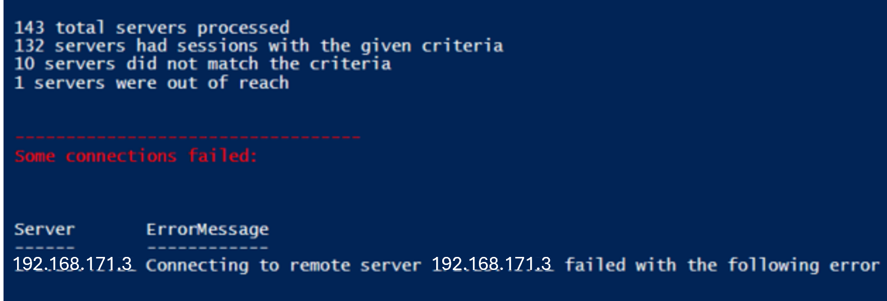

# Windows

Windows docs, PowerShell, and CMD commands.

## PowerShell Version

The scripts are compatible with PowerShell version `5` and later

---

### 1. logoff user (local computer).ps1

This very simple script demonstrates how to extract the session Id of an account and pass it to the logoff command at will
 to log off that user. Obviously, admin rights are required to log off other users' sessions. The log off command only accepts
 the user's session Id.

---
 
### 2. Execute Logout on Remote Servers Serially (Sequentially)

This script is the development of the 1st script to execute logoff command on as many remote servers as you desire. This is very
 helpful when you change your domain password and have some disconnected sessions running and are not sure on which servers they
 are. Such occasion most likely will result in constant and perpetual lock out of your account because of the multiple wrong password
 entry of your user by the open sessions which can be very annoying.

This script can also be used as a report to identify the users that have logged into your servers.

This script can both report the servers with your logged on sessions and also execute remote logoff command for your or
 someone else's session.

---

### 3. Execute Logout on Remote Servers in Parallel

This script is the development of the 2nd script to execute logoff command on as many remote servers as you desire. This is very
 helpful when you change your domain password and have some disconnected sessions running and are not sure on which servers they
 are. Such occasion most likely will result in constant and perpetual lock out of your account because of the multiple wrong password
 entry of your user by the open sessions which can be very annoying.

This script can also be used as a report to identify the users that have logged into your servers.

This script can both report the servers with your logged on sessions and also execute remote logoff command for you or
 someone else's session.
 
The input "$user" parameter can be a regular expression. The found results per server can be a list of any users matching the search pattern "$user"

*Sample output for $user = ".":*

Or, output when some connections fail:

---

<!--
4. Execute any Script on Remote Servers in Parallel:

Execute any script on multiple remote servers in parallel
-->

---

## Generated Docs Index

### Cheat Sheets (Type 1)

- [Windows cheat-sheet](Cheat%20Sheet/cheat-sheet.md)

### Instruction Sets (Type 2)

- [Install OpenSSH Server on Windows](Instruction%20Sets/install_openssh_server_on_windows_instructions.md)
- [Install WSL and manage distributions](Instruction%20Sets/install_wsl_on_windows_and_manage_distributions_instructions.md)
- [Configure WSL resources, DNS, and backups](Instruction%20Sets/configure_wsl_resources_dns_and_backup_instructions.md)
- [Install PowerShell modules offline](Instruction%20Sets/install_powershell_modules_offline_instructions.md)
- [Fix SAN LUN going offline after reboot](Instruction%20Sets/fix_san_lun_offline_after_reboot_instructions.md)
- [Disable other Microsoft product updates](Instruction%20Sets/disable_other_microsoft_products_updates_in_windows_update_instructions.md)
- [Map a network drive persistently](Instruction%20Sets/map_network_drive_persistently_instructions.md)
- [Enable PowerShell remoting and run remote commands](Instruction%20Sets/enable_powershell_remoting_and_run_commands_remotely_instructions.md)
- [Elevate a batch file to admin](Instruction%20Sets/elevate_batch_file_to_admin_instructions.md)
- [Install Git and clone/pull a repo](Instruction%20Sets/install_git_and_clone_repo_instructions.md)
- [Install package managers (Chocolatey, winget)](Instruction%20Sets/install_windows_package_managers_instructions.md)
- [Manage RDP sessions and log off users](Instruction%20Sets/manage_rdp_sessions_and_logoff_users_instructions.md)
